<table>
<tr>
<td valign="top"></td>
<td valign="top"></td>
</tr>
</table>

## Mayank Bisht

**Computer Science & Engineering Undergrad &nbsp;·&nbsp; Browser Architecture &nbsp;·&nbsp; Creative Systems**

I design and build software with a focus on browser internals, interactive rendering pipelines, and developer tooling. Interested in first-principles engineering, Chrome extension architecture, and high-performance web systems.

[Portfolio](https://meet-precision.vercel.app) &nbsp;·&nbsp; [GitHub](https://github.com/Cicada33016)

---

### Selected Work

<table>
<tr>
<td width="50%" valign="top">

#### Coursera Assistant
*Browser Automation & AI Workflow Suite*

Chrome Extension (Manifest V3) engineered for automated navigation, DOM observation, and contextual problem-solving on web learning platforms. Built with background service workers, mutation listeners, and robust error recovery without interfering with native application state.

 

**Stack:** `TypeScript` · `Chrome Extensions MV3` · `DOM Observers` · `REST API`  
**Links:** [Repository](https://github.com/Cicada33016)

</td>
<td width="50%" valign="top">

#### Meet Precision
*Interactive Canvas Motion Architecture*

High-performance web experience powered by a 250-frame pre-rendered canvas animation pipeline. Features custom frame interpolation, smooth scroll synchronization, and optimized asset delivery for responsive 60fps interaction across devices.

 

**Stack:** `Next.js 15` · `React 19` · `HTML5 Canvas API` · `GSAP / Framer Motion`  
**Links:** [Live Application](https://meet-precision.vercel.app)

</td>
</tr>
</table>

---

### Activity

---

Engineered with custom ASCII art, SVG animations, and daily GitHub Actions. Open source at <a href="https://github.com/Cicada33016/Cicada33016">Cicada33016/Cicada33016</a>.

